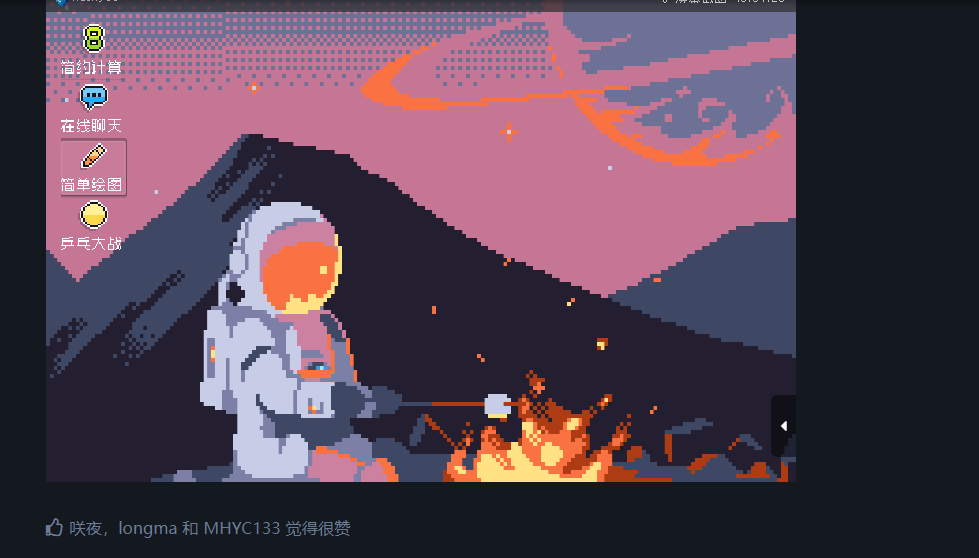
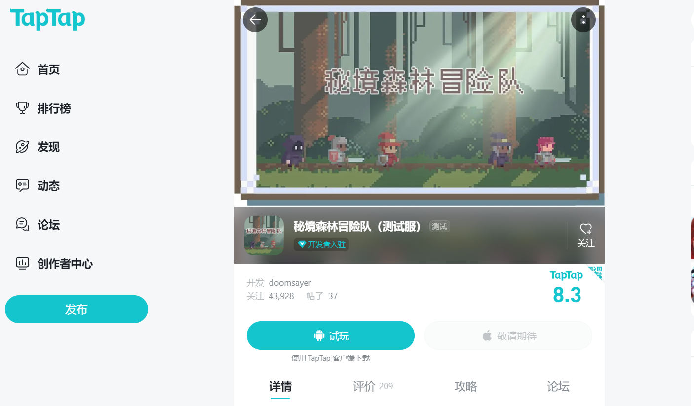

收集的资料：

论坛里面看到关于技术人的35岁焦虑问题：
https://godoter.cn/blog/304-zuo-wei-da-ling-cheng-xu-yuan-ni-ru-he-chi-xu-de-bao-chi-zi-ji-de-jing-zheng-you-shi

awesome-awesomeness: 
https://github.com/bayandin/awesome-awesomeness

python论坛：https://fishc.com.cn/thread-116492-1-1.html

python GUI库有哪些？
(Tkinter, Kivy, Pyqt, wxPython 这四个是在没有搜索的时候，就比较熟悉的)
https://jiazi.natyun.net/5407.html (这篇文列举了11个)
https://baijiahao.baidu.com/s?id=1751367833923725788&wfr=spider&for=pc （10个）

1. dearpygui: https://pypi.org/project/dearpygui/
2. PyGObject: http://pygobject.readthedocs.io/en/latest/getting_started.html
3. PyQt6：https://pypi.org/project/PyQt6/
4. Pywin32: https://www.oschina.net/p/pywin32
5. pyGtk:  https://www.oschina.net/p/pygtk
6. kivy: https://kivy.org/
7. flexx: https://flexx.readthedocs.io/en/stable/
8. wxpython: https://www.wxpython.org/
9. tkinter: https://docs.python.org/zh-cn/3/library/tkinter.html
10. Urwid: http://urwid.org/tutorial/

游戏领域：

新手上手游戏路线（总结下来就是，先把点子想清楚，用最简单易上手的方式实现）： https://www.zhihu.com/question/538970292/answer/2591970473 

论坛里面看到的2048游戏： 
https://godoter.cn/d/52-2048 （（可玩）
https://game.thetbw.xyz/2048/

仿OS界面的小软件有点意思：
https://godoter.cn/d/69-godotgui/4
!

秘密森林冒险队仿制版： https://www.taptap.cn/app/227563

游戏服务器资源大全:https://github.com/hstcscolor/awesome-gameserver-cn

python游戏（数独、像素鸟、贪吃蛇）https://github.com/NemoHoHaloAi/Game

python(一些用python写的小游戏，包括飞船大战，坦克大战，扫雷，俄罗斯方块，五子棋游戏，贪吃蛇，数字游戏，还包括成绩管理系统与天气查询系统的实现以及turtle绘制小猪佩奇，皮卡丘与哆啦A梦）持续更新中:
https://github.com/liuzuoping/python_Games

微信小游戏（微信开发工具自带webpack， 这里webpack用于H5调试
愤怒的小鸟 贪吃蛇 飞机大战 坦克大战 消消乐 星图 大家来找茬）：
https://github.com/Aimee1608/wechatGame-all

别人做的游戏收集资料： https://github.com/Leo501/awesome-CocosCreator
CocosCreator文档（Cocos Creator 是一个开源引擎，连同范例、文档都是开源的）：
https://docs.cocos.com/creator/manual/zh/glossary/
cocos介绍：
https://zhuanlan.zhihu.com/p/599811067
https://www.cocos.com/about

游戏引擎介绍（Unity, Cocos, Laya, UE4, 白鹭, Godot）：https://zhuanlan.zhihu.com/p/551659385
godotengine： https://godotengine.org/
godot文档： https://docs.godotengine.org/zh_CN/latest/getting_started/introduction/introduction_to_godot.html
网页编辑入口： https://editor.godotengine.org/releases/latest/
网页编辑版本文档： https://docs.godotengine.org/en/latest/tutorials/editor/using_the_web_editor.html
godot贴吧（介绍godot论坛集合）： https://tieba.baidu.com/p/8335499872 （截至2023/2/7 共有主题数1981个，贴子数 17553篇 godot数3136）
godot论坛（21年底创建的，好像挺活跃的，GodoterCN还提供GDScript在线编辑、运行、分享功能，用户可以在任意设备上实验各类代码，还可以一键将代码保存到GodoterCN代码云并生成分享链接，其他用户打开链接即可看到分享的代码内容并即时运行）： https://godoter.cn/categories

基于图像的游戏AI自动化框架:
https://github.com/Tencent/GameAISDK

Airtest是一款跨平台的UI自动化测试框架，基于 图像识别原理 ，适用于游戏和App(网易官方提供的):
https://airtest.doc.io.netease.com/IDEdocs/airtest_framework/0_airtest_info/
https://airtest-refactor.doc.io.netease.com/airtest-project-docs/summary/summary/（教程文档）